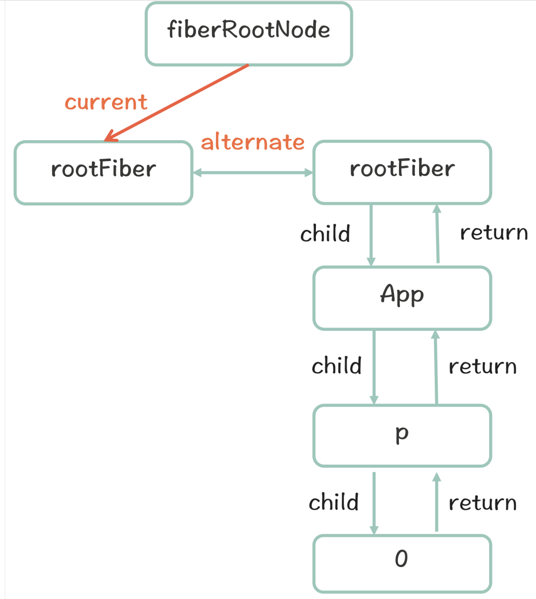

`React16`除了新增了`Hooks`Api 外，在核心架构上也发生了很大变化----同步更新重构为异步可中断更新。
也就是`React` 的 `Fiber`架构。

首先让我们来回忆一下 React15 的架构：

## React 架构演进

### React15 架构

#### React15 架构可以分为两层：

- Reconciler（协调器）—— 负责找出变化的组件
- Renderer（渲染器）—— 负责将变化的组件渲染到页面上

##### Reconciler（协调器）

我们知道，在`React`中可以通过`this.setState`、`this.forceUpdate`、`ReactDOM.render`等 API 触发更新。

每当有更新发生时，`Reconciler`会做如下工作：

- 调用函数组件、或 class 组件的 render 方法，将返回的 JSX 转化为虚拟 DOM
- 从父节点（Virtual DOM）开始向下遍历,将虚拟 DOM 和上次更新时的虚拟 DOM 对比
- 通过对比找出本次更新中变化的虚拟 DOM
- 通知`Renderer`将变化的虚拟 DOM 渲染到页面上

它的执行过程很像函数的递归，所以，Reac15 的`Reconciler`也称为`Stack Reconciler`。

##### Renderer（渲染器）

由于`React`支持跨平台，所以不同平台有不同的**Renderer**。我们前端最熟悉的是负责在浏览器环境渲染的 Renderer —— `ReactDOM`。

除此之外，还有：

- ReactNative 渲染器，渲染 App 原生组件
- ReactTest 渲染器，渲染出纯 Js 对象用于测试
- ReactArt 渲染器，渲染到 Canvas, SVG 或 VML (IE8)
  在每次更新发生时，Renderer 接到 Reconciler 通知，将变化的组件渲染在当前宿主环境。

#### React15 框架下状态更新的特点

- 一旦开始递归，无法停止
- Reconciler 和 Render 交替工作
- mount 的组件会调用 mountComponent，update 的组件会调用 updateComponent。这两个方法都会递归更新子组件。

#### React15 架构的缺点

主流的浏览器刷新频率为 60Hz，即每（1000ms / 60Hz）16.6ms 浏览器刷新一次。
在每 16.6ms 时间内，需要完成如下工作：

```
JS脚本执行---样式布局----样式绘制
```

我们知道，JS 可以操作 DOM，GUI 渲染线程与 JS 线程是互斥的。所以 JS 脚本执行和浏览器布局、绘制不能同时执行。
当 JS 执行时间过长，超出了 16.6ms，这次刷新就没有时间执行样式布局和样式绘制了。

对于用户在输入框输入内容这个行为来说，就体现为按下了键盘按键但是页面上不实时显示输入。

对于 React 的更新来说，由于递归执行，所以更新一旦开始，中途就无法中断。当层级很深时，递归更新时间超过了 16ms，用户交互就会卡顿。

### React16 架构

正式由于 React15 架构无法中断的同步更新，React 团队重构了 React 的整体架构，实现了异步可中断更新。

在 React 16 架构中，将更新过程切割为多个步骤，分批完成。也就是说在完成一部分任务后，看是否还有剩余时间，如果有继续下一个任务；如果没有，挂起当前任务，将控制权交回给浏览器。让浏览器有时间进行页面渲染，等浏览器完成任务之后再继续之前的未完成的任务。

React16 架构可以分为三层：

- Scheduler（调度器）—— 产生更新，调度任务（优先级，高优任务优先进入 Reconciler； 浏览器空闲）
- Reconciler（协调器）—— 负责找出变化的组件
- Renderer（渲染器）—— 负责将变化的组件渲染到页面上

#### Scheduler（调度器）

Scheduler 的作用有两个：

- 调度任务的优先级，高优任务优先进入 Reconciler；
- 浏览器空闲时触发回调 ---- 通过 update.lane 区分优先级

浏览器空闲触发回调的原理与[requestIdleCallback](https://developer.mozilla.org/zh-CN/docs/Web/API/Window/requestIdleCallback)相同，部分浏览器已经实现了这个 API。

> window.requestIdleCallback()方法将在浏览器的空闲时段内调用的函数队列。这使开发者能够在主事件循环上执行后台和低优先级工作，而不会影响延迟关键事件，如动画和输入响应。函数一般会按先进先调用的顺序执行，然而，如果回调函数指定了执行超时时间 timeout，则有可能为了在超时前执行函数而打乱执行顺序。

> 你可以在空闲回调函数中调用 requestIdleCallback()，以便在下一次通过事件循环之前调度另一个回调。

浏览器是一帧一帧执行的，在两个执行帧之间，主线程通常会有一小段空闲时间，requestIdleCallback 可以在这个空闲期（Idle Period）调用空闲期回调（Idle Callback），执行一些任务。


- 高优先级任务，如动画相关的由 requestAnimationFrame 处理；
- - 低优先级任务由 requestIdleCallback 处理；
- requestIdleCallback 可以在多个空闲期调用空闲期回调，执行任务；
- requestIdleCallback 方法提供 deadline，即任务执行限制时间，以切分任务，避免长时间执行，阻塞 UI 渲染而导致掉帧；

##### Reconciler（协调器）

在 React15 中 Reconciler 是递归处理虚拟 DOM 的, 在 React16 中递归更新变成了可中断的循环过程，每次循环都会调用`shouldYiele`判断是否有剩余时间。

```js
/** @noinline */
function workLoopConcurrent() {
  // Perform work until Scheduler asks us to yield
  while (workInProgress !== null && !shouldYield()) {
    workInProgress = performUnitOfWork(workInProgress);
  }
}
```

那么 React16 是如何解决中断更新时 DOM 渲染不完全的问题呢？

在 React16 中，Reconciler 与 Renderer 不再是交替工作。当 Scheduler 将任务交给 Reconciler 后，Reconciler 会为变化的虚拟 DOM 打上代表增/删/更新的标记，类似这样：

```js
export const Placement = /*             */ 0b0000000000010;
export const Update = /*                */ 0b0000000000100;
export const PlacementAndUpdate = /*    */ 0b0000000000110;
export const Deletion = /*              */ 0b0000000001000;
```

整个 Scheduler 与 Reconciler 的工作都在内存中进行。只有当所有组件都完成 Reconciler 的工作，才会统一交给 Renderer。

##### Renderer（渲染器）

Renderer 根据 Reconciler 为虚拟 DOM 打的标记，同步执行对应的 DOM 操作。

我们用一个小例子来看下，在 React16 架构中整个更新流程：

```js
class App extends React.Component {
  constructor(...props) {
    super(...props);
    this.state = {
      count: 1,
    };
  }
  onClick() {
    this.setState({
      count: this.state.count + 1,
    });
  }
  render() {
    return (
      <ul>
        <button onClick={() => this.onClick()}>乘以{this.state.count}</button>
        <li>{1 * this.state.count}</li>
        <li>{2 * this.state.count}</li>
        <li>{3 * this.state.count}</li>
      </ul>
    );
  }
}

ReactDOM.render(<App />, document.getElementById('app'));
```


其中红框中的步骤随时可能由于以下原因被中断：

- 有其他更高优任务需要先更新
- 当前帧没有剩余时间
  由于红框中的工作都在内存中进行，不会更新页面上的 DOM，所以即使反复中断，用户也不会看见更新不完全的 DOM

## React Fiber 架构原理

### 什么是`React Fiber`

前面讲解 React16 架构时，我们说 React16 实现了异步可中断更新。异步可中断更新可以理解为：更新在执行过程中可能会被打断（浏览器时间分片用尽或有更高优任务插队），当可以继续执行时恢复之前执行的中间状态。
`React Fiber`就是实现这个过程的状态更新机制。

#### React Fiber 的三层含义

1. 作为架构来说，之前 React15 的 Reconciler 采用递归的方式执行，数据保存在递归调用栈中，所以被称为 stack Reconciler。React16 的 Reconciler 基于 Fiber 节点实现，被称为 Fiber Reconciler。

2. 作为静态的数据结构来说，每个 Fiber 节点对应一个 React element，保存了该组件的类型（函数组件/类组件/原生组件...）、对应的 DOM 节点等信息。

3. 作为动态的工作单元来说，每个 Fiber 节点保存了本次更新中该组件改变的状态、要执行的工作（需要被删除/被插入页面中/被更新...）。

#### React Fiber 结构

```js
function FiberNode(
  tag: WorkTag,
  pendingProps: mixed,
  key: null | string,
  mode: TypeOfMode
) {
  // 作为静态数据结构的属性
  // Fiber对应组件的类型 FunctionComponent：0;ClassComponent:1; HostRoot：3; HostComponent: 5
  this.tag = tag;
  this.key = key;
  // 大部分情况同type，某些情况不同，比如FunctionComponent使用React.memo包裹
  this.elementType = null;
  // 对于 FunctionComponent，指函数本身，对于ClassComponent，指class，对于HostComponent，指DOM节点tagName

  this.type = null;
  // Fiber对应的真实DOM节点
  this.stateNode = null;

  // 用于连接其他Fiber节点形成Fiber树
  this.return = null;
  this.child = null;
  this.sibling = null;
  this.index = 0;

  this.ref = null;

  // 作为动态的工作单元的属性
  this.pendingProps = pendingProps;
  this.memoizedProps = null;
  this.updateQueue = null;
  this.memoizedState = null;
  this.dependencies = null;

  this.mode = mode;
  // 保存本次更新会造成的DOM操作
  this.effectTag = NoEffect;

  //单链表结构，方便遍历fiber树上有副作用的节点
  this.nextEffect = null;
  this.firstEffect = null;
  this.lastEffect = null;

  // 调度优先级相关
  this.lanes = NoLanes;
  this.childLanes = NoLanes;

  // 指向该fiber在另一次更新时对应的fiber
  this.alternate = null;
}
```

作为架构，Fiber 节点保存了将 Fiber 连接成树的属性,
如下的组件，会形成下图的树形结构：

```js
function App() {
  return (
    <div>
      i am
      <span>xiaohong</span>
    </div>
  );
}
```


##### Fiber 架构的链表（effectList）

React 在对每个 Fiber 节点进行 diff 运算之后会为产生更新的节点打上 effectTag,作为 DOM 更新的依据

实现高性能，React 构建了一条带有 effectTag 的 Fiber 节点的线性列表

借用 React 团队成员 Dan Abramov 的话：effectList 相较于 Fiber 树，就像圣诞树上挂的那一串彩灯。


所有有 effectTag 的 Fiber 节点都会被追加在 effectList 中，最终形成一条以 rootFiber.firstEffect 为起点的单向链表。


##### Fiber 架构的双缓存机制

在 React 中最多会同时存在两棵 Fiber 树。当前屏幕上显示内容对应的 Fiber 树称为 current Fiber 树，正在内存中构建的 Fiber 树称为 workInProgress Fiber 树。
current Fiber 树中的 Fiber 节点被称为 current fiber，workInProgress Fiber 树中的 Fiber 节点被称为 workInProgress fiber，他们通过 alternate 属性连接。

React 应用的根节点通过 current 指针在不同 Fiber 树的 rootFiber 间切换来实现 Fiber 树的切换。

当 workInProgress Fiber 树构建完成交给 Renderer 渲染在页面上后，应用根节点的 current 指针指向 workInProgress Fiber 树，此时 workInProgress Fiber 树就变为 current Fiber 树。

每次状态更新都会产生新的 workInProgress Fiber 树，通过 current 与 workInProgress 的替换，完成 DOM 更新。

我们以下面的小例子，来描述 fiber 数构建和更新时流程：

```js
function App() {
  const [num, add] = useState(0);
  return <p onClick={() => add(num + 1)}>{num}</p>;
}

ReactDOM.render(<App />, document.getElementById('root'));
```

mount 时：

首次执行`ReactDOM.render`会创建`fiberRootNode`（源码中叫 fiberRoot）和`rootFiber`。其中`fiberRootNode`是整个应用的根节点，`rootFiber`是所在组件树的根节点。
之所以要区分 f`iberRootNode`与`rootFiber`，是因为在应用中我们可以多次调用`ReactDOM.render`渲染不同的组件树，他们会拥有不同的`rootFiber`。但是整个应用的根节点只有一个，那就是`fiberRootNode`。
`fiberRootNode`的 current 会指向当前页面上已渲染内容对应对 Fiber 树，被称为 current Fiber 树。
首屏渲染时，页面中还没有挂载任何 DOM，所以`fiberRootNode.current`指向的 rootFiber 没有任何子 Fiber 节点（即 current Fiber 树为空）；


接下来进入 render 阶段，首先会根据`fiberRootNode`的 current 节点（即 current `rootFiber`节点）创建 workInProgress `rootFibe`r 节点，并将它们通过`alternate`属性链接起来，然后根据组件返回的 JSX 在内存中依次创建 Fiber 节点并连接在一起构建 Fiber 树，被称为 workInProgress Fiber 树。（下图中右侧为内存中构建的树，左侧为页面显示的树）




建完的 workInProgress Fiber 树在 commit 阶段渲染到页面。
`fiberRootNode`的 current 指针指向 workInProgress Fiber 树使其变为 current Fiber 树。


**update**时：
更新时，会构建一颗新的 workInProgress Fiber 树, 同样首先会根据`fiberRootNode`的 current 节点（即 current `rootFiber`节点）创建 workInProgress `rootFibe`r 节点，并将它们通过`alternate`属性链接起来，然后根据组件返回的 JSX 在内存中依次创建 Fiber 节点并连接在一起构建 Fiber 树，被称为 workInProgress Fiber 树。在构建 workInProgress Fiber 的构建会复用可复用的 current Fiber.


> 这里判断已有节点是否可复用的流程就是 Diff 算法；


### React 工作流程

#### 首屏渲染

即使是一个简单的 DOM 渲染，React 的调用栈中也调用了大量的函数，我们把整个执行过程按照调用栈来划分，可以分为三个阶段

分别对应了源码架构中的三大模块：调度 → 协调 → 渲染


首屏渲染：


调用`ReactDOM.render(element, root)`时，React 会调用`createElementWithValidation`将`element`组件，解析为`ReactElement`对象，格式如下：

```js
{
    $$typeof: Symbol(react.element)
    key: null
    props: {}
    ref: null
    type: ƒ App()
    _owner: null
    _store: {validated: false}
    _self: null
    _source: {fileName: "/Users/zhaohongyun1/xh-project/react源码/testdemo/src/index.js", lineNumber: 6, columnNumber: 17}
    __proto__: Object
}
```

然后调用`ReactDOM.render`方法，执行`legacyRenderSubtreeIntoContainer`--`legacyCreateRootFromDOMContainer`--`createRootImpl`--`createLegacyRoot`--`createHostRootFiber`--`createFiberRoot`,创建`fiberRootNode`和`rootFiber`,并把`fiberRootNode`的 current 执向`rootFiber`， `rootFiber`的 stateNode 属性指向`fiberRootNode`,

在`createFiberRoot`中还会初始化`updateQueue`,挂载在`rootFiber`节点上,update 对象格式为：`{baseState: null,effects: null,firstBaseUpdate: null,lastBaseUpdate: null,shared: {pending: null}}`

```js
// ReactFiberRoot.old.js

export function createFiberRoot(
  containerInfo: any,
  tag: RootTag,
  hydrate: boolean,
  hydrationCallbacks: null | SuspenseHydrationCallbacks
): FiberRoot {
  // 创建fiberRootNode
  const root: FiberRoot = (new FiberRootNode(containerInfo, tag, hydrate): any);
  if (enableSuspenseCallback) {
    root.hydrationCallbacks = hydrationCallbacks;
  }

  // 创建rootFiber节点
  const uninitializedFiber = createHostRootFiber(tag);
  // 把fiberRootNode的current执向rootFiber，rootFiber的stateNode属性执向fiberRootNode,
  root.current = uninitializedFiber;
  uninitializedFiber.stateNode = root;
  //初始化 updateQueue,挂载在rootFiber节点上
  initializeUpdateQueue(uninitializedFiber);

  return root;
}
```

接下来进入`unbatchedUpdates`的回调函数执行`updateContainer`, 创建`update`对象（`var update = createUpdate(eventTime, lane, suspenseConfig);`）然后将`ReactDOM.render`方法的生成的 element 对象，放在 upldat 的 payl 属性中

```js
update.payload = {
  element: element,
};
```
